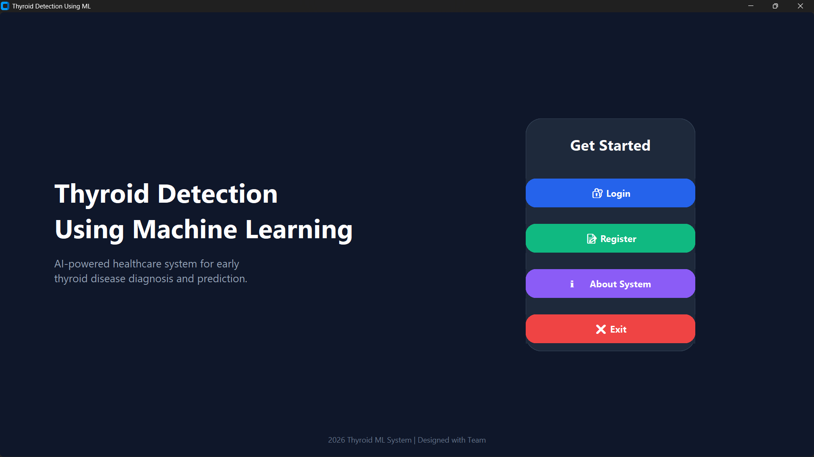
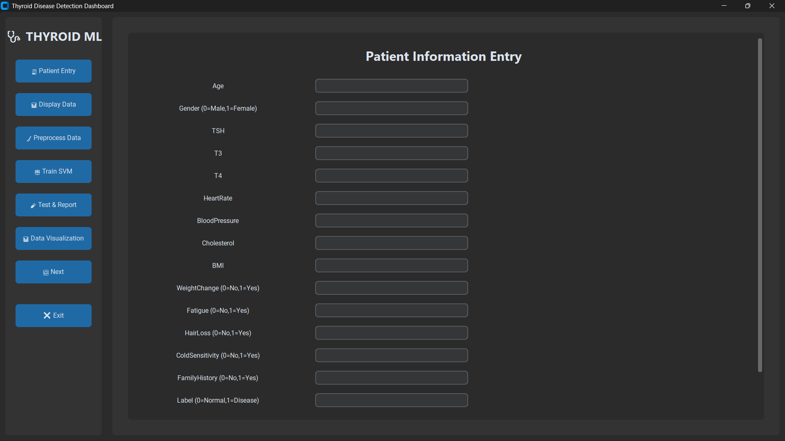
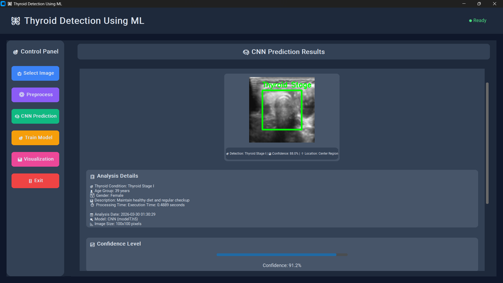
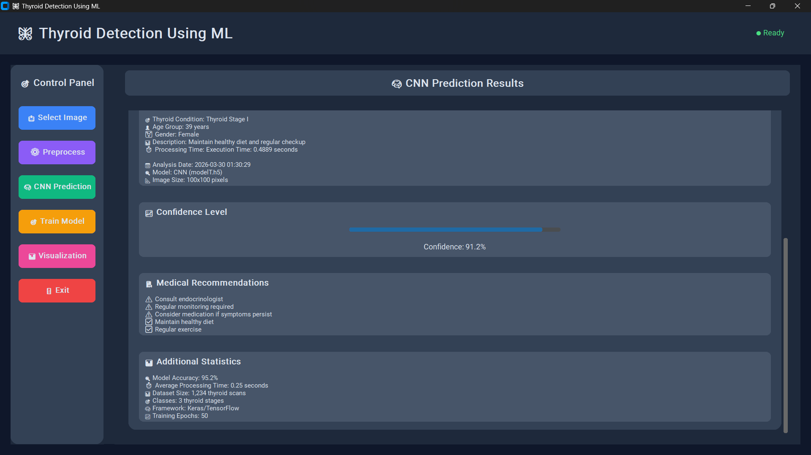

# 🩺 Hybrid Thyroid Disease Detection System


An AI-powered hybrid system for thyroid disease detection using **Ultrasound Images** and **Clinical Blood Test Parameters (T3, T4, TSH)**. The project combines **Deep Learning (CNN)** and **Machine Learning (Random Forest)** to improve diagnostic accuracy through decision-level fusion.

---

## 📌 Project Overview

Thyroid disorders are among the most common endocrine diseases worldwide. Traditional diagnosis relies on ultrasound imaging and blood test reports separately, which may lead to delayed or less accurate diagnosis.

This project introduces a **Hybrid Multimodal Thyroid Disease Detection System** that integrates:

- 📷 Ultrasound Image Analysis using CNN
- 🧪 Blood Test Analysis using Random Forest
- 🤝 Decision-Level Fusion for final prediction
- 🖥️ User-friendly GUI for diagnosis

---

## 🚀 Features

- Hybrid AI-based disease detection
- CNN model for ultrasound image classification
- Random Forest model for blood test prediction
- Decision-level fusion for improved accuracy
- Graphical User Interface (GUI)
- Login authentication
- Fast and accurate predictions
- Easy-to-use interface

---

## 🛠️ Technologies Used

| Category | Technologies |
|----------|--------------|
| Programming | Python |
| Deep Learning | TensorFlow, Keras |
| Machine Learning | Scikit-learn |
| Image Processing | OpenCV |
| GUI | CustomTkinter, Tkinter |
| Data Analysis | Pandas, NumPy |
| Visualization | Matplotlib |
| Model Storage | Joblib |

---

## 📂 Project Structure

```
Hybrid-Thyroid-Disease-Detection
│
├── src/
│   ├── CNNModel.py
│   ├── GUI_main.py
│   ├── GUI_Master_old.py
│   └── login.py
│
├── models/
│   ├── model.h5
│   └── thyroid_model.pkl
│
├── dataset/
│   ├── train/
│   ├── test/
│   └── validation/
│
├── images/
│
├── documentation/
│
├── requirements.txt
├── README.md
└── .gitignore
```

---

## ⚙️ Installation

Clone the repository

```bash
git clone https://github.com/YOUR_USERNAME/Hybrid-Thyroid-Disease-Detection.git
```

Navigate to project directory

```bash
cd Hybrid-Thyroid-Disease-Detection
```

Install dependencies

```bash
pip install -r requirements.txt
```

Run the application

```bash
python src/GUI_main.py
```

---

## 🧠 System Workflow

```text
Ultrasound Image
        │
        ▼
 CNN Image Classification
        │
        ▼

Blood Test Values
(T3, T4, TSH)
        │
        ▼
Random Forest Prediction
        │
        ▼

Decision Level Fusion
        │
        ▼

Final Disease Prediction
```

---

## 📊 Model Performance

| Model | Accuracy |
|--------|---------:|
| Random Forest | 91.5% |
| CNN | 93.2% |
| Hybrid Model | **96.1%** |

---

# 📸 Screenshots

## Login Page



---

## Dashboard



---

## Prediction Window



---

## Results



---

## System Architecture


---

## 📈 Future Enhancements

- Cloud Deployment
- Mobile Application
- Real-time Clinical Integration
- Explainable AI (Grad-CAM & SHAP)
- Multi-disease Classification

---

## 👨‍💻 Author

**Shreyash Nighot**

Bachelor of Engineering (Computer Engineering)

Artificial Intelligence & Machine Learning Enthusiast

GitHub: https://github.com/shreyasnighot

LinkedIn: *(Add your LinkedIn profile here)*

---

## 📄 License

This project is licensed under the MIT License.

---

## ⭐ Support

If you found this project useful, please consider giving it a ⭐ on GitHub.
# 🩺 Hybrid Thyroid Disease Detection System


An AI-powered hybrid system for thyroid disease detection using **Ultrasound Images** and **Clinical Blood Test Parameters (T3, T4, TSH)**. The project combines **Deep Learning (CNN)** and **Machine Learning (Random Forest)** to improve diagnostic accuracy through decision-level fusion.

---

## 📌 Project Overview

Thyroid disorders are among the most common endocrine diseases worldwide. Traditional diagnosis relies on ultrasound imaging and blood test reports separately, which may lead to delayed or less accurate diagnosis.

This project introduces a **Hybrid Multimodal Thyroid Disease Detection System** that integrates:

- 📷 Ultrasound Image Analysis using CNN
- 🧪 Blood Test Analysis using Random Forest
- 🤝 Decision-Level Fusion for final prediction
- 🖥️ User-friendly GUI for diagnosis

---

## 🚀 Features

- Hybrid AI-based disease detection
- CNN model for ultrasound image classification
- Random Forest model for blood test prediction
- Decision-level fusion for improved accuracy
- Graphical User Interface (GUI)
- Login authentication
- Fast and accurate predictions
- Easy-to-use interface

---

## 🛠️ Technologies Used

| Category | Technologies |
|----------|--------------|
| Programming | Python |
| Deep Learning | TensorFlow, Keras |
| Machine Learning | Scikit-learn |
| Image Processing | OpenCV |
| GUI | CustomTkinter, Tkinter |
| Data Analysis | Pandas, NumPy |
| Visualization | Matplotlib |
| Model Storage | Joblib |

---

## 📂 Project Structure

```
Hybrid-Thyroid-Disease-Detection
│
├── src/
│   ├── CNNModel.py
│   ├── GUI_main.py
│   ├── GUI_Master_old.py
│   └── login.py
│
├── models/
│   ├── model.h5
│   └── thyroid_model.pkl
│
├── dataset/
│   ├── train/
│   ├── test/
│   └── validation/
│
├── images/
│
├── documentation/
│
├── requirements.txt
├── README.md
└── .gitignore
```

---

## ⚙️ Installation

Clone the repository

```bash
git clone https://github.com/YOUR_USERNAME/Hybrid-Thyroid-Disease-Detection.git
```

Navigate to project directory

```bash
cd Hybrid-Thyroid-Disease-Detection
```

Install dependencies

```bash
pip install -r requirements.txt
```

Run the application

```bash
python src/GUI_main.py
```

---

## 🧠 System Workflow

```text
Ultrasound Image
        │
        ▼
 CNN Image Classification
        │
        ▼

Blood Test Values
(T3, T4, TSH)
        │
        ▼
Random Forest Prediction
        │
        ▼

Decision Level Fusion
        │
        ▼

Final Disease Prediction
```

---

## 📊 Model Performance

| Model | Accuracy |
|--------|---------:|
| Random Forest | 91.5% |
| CNN | 93.2% |
| Hybrid Model | **96.1%** |

---

# 📸 Screenshots

## Login Page


---

## Dashboard


---

## Prediction Window


---

## Results


---

## System Architecture


---

## 📈 Future Enhancements

- Cloud Deployment
- Mobile Application
- Real-time Clinical Integration
- Explainable AI (Grad-CAM & SHAP)
- Multi-disease Classification

---

## 👨‍💻 Author

**Shreyas Nighot**

Bachelor of Engineering (Computer Engineering)

Artificial Intelligence & Machine Learning Enthusiast

GitHub: https://github.com/shreyasnighot

LinkedIn: *(Add your LinkedIn profile here)*

---

## 📄 License

This project is licensed under the MIT License.

---

## ⭐ Support

If you found this project useful, please consider giving it a ⭐ on GitHub.
